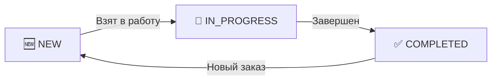

# 📦 QR Code Recipes — Next.js Fullstack App

Это fullstack-приложение, созданное на базе **Next.js**. Оно позволяет создавать рецепты (или инструкции) с параметрами различных типов и мгновенно генерировать уникальные QR-коды для доступа к ним.

---

## 🚀 Функциональность

- 📄 **Создание рецептов** с параметрами: текст, область ввода или файл.
- 🔐 Хранение QR-кодов в Vercel Blob
- 🧾 **Генерация QR-кодов** с помощью [`qr-code-styling`](https://github.com/kozakdenys/qr-code-styling)
  - Поддержка логотипов, цветных точек и фона
  - **Сохранение QR-кодов в [Vercel Blob](https://vercel.com/docs/storage/vercel-blob)** — быстрое и надёжное хранение изображений
- 🌐 **App Router + React Server Components** — современная маршрутизация и рендеринг.
- 📊 **Удобная таблица параметров** — структурированный вывод всех деталей рецепта.
---

---
### Интеграции
- 🧑‍💼 **Команда**: Kanban-доска заказов с Socket.IO
- 📅 **Календарь**: Интерфейс как Google Calendar
- 🗺️ **Карта**: Интеграция с Leaflet
- 🤖 **Telegram**: Создание заказов через бота
---

## 🛠️ Технологии

- [Next.js (App Router)](https://nextjs.org/docs/app) — серверные компоненты и маршруты
- [TypeScript](https://www.typescriptlang.org/) — строгая типизация
- [React Query (для работы с API)](https://tanstack.com/query) — работа с api
- [React Hook Form](https://react-hook-form.com/) — формы и валидация
- [Zod](https://zod.dev/) — схема валидации
- [qr-code-styling](https://www.npmjs.com/package/qr-code-styling) — кастомизация QR-кодов
- [Tailwind CSS](https://tailwindcss.com/) — современная стилизация
- [shadcn/ui](https://ui.shadcn.com/) — headless готовые UI-компоненты

---

---
## Swagger
 - https://socket-server-qr-code.onrender.com
---

### 🧹 Линтинг и форматирование

- **[Prettier](https://prettier.io/)** — автоматическое форматирование кода
- **[ESLint](https://eslint.org/)** — анализ и проверка кода

---

## 💾 Развёртывание

Приложение можно развернуть на [Vercel](https://vercel.com) — платформе от создателей Next.js.
Хранилище данных подключается через [Neon.tech](https://neon.tech) или любой другой PostgreSQL-хостинг.

📄 Документация: [Deploying Next.js](https://nextjs.org/docs/app/building-your-application/deploying)


```mermaid
graph TD
    A[Frontend - Next.js] --> B[Backend - NestJS]
    B --> C[PostgreSQL]
    A --> D[Vercel Blob]
    B --> E[Telegram API]
    A --> F[Socket.IO]

---

## 📚 Дополнительно

- [📘 Документация Next.js](https://nextjs.org/docs)
- [📘 Примеры с React Hook Form](https://react-hook-form.com/get-started)


## ▶️ Как запустить

## Установка зависимостей
```bash
pnpm install
```

## Запуск приложения в режиме разработки
```bash
pnpm run dev
```
## Линтинг проекта (ESLint + TypeScript)
```bash
pnpm run lint
```

## Сборка production-версии
```bash
pnpm run build
```

## Запуск production-сервера
```bash
pnpm start
```

💡 Полезные команды разработки

## Очистить .next, node_modules, и переустановить зависимости
```bash
rm -rf node_modules .next && pnpm install
```

## 🌍 Интернационализация (i18n)

Приложение поддерживает **мультиязычный интерфейс** с помощью библиотеки [`next-intl`](https://next-intl-docs.vercel.app/). Это позволяет легко адаптировать UI под разные языки пользователей.

### 🌐 Поддерживаемые языки:

- 🇷🇺 Русский (`ru`)
- 🇺🇸 Английский (`en`)
- 🇮🇱 Иврит (`he`)


## 🧑‍💼 Employee Page — Kanban-доска заказов

Страница сотрудника представляет собой **Kanban-доску**, которая отображает все его заказы по статусам:

- 🆕 `NEW` — Новый заказ
- 🔄 `IN_PROGRESS` — В процессе выполнения
- ✅ `COMPLETED` — Завершён

### 📦 Возможности доски:

- 🧲 **Drag & Drop** заказов между колонками с помощью [`@dnd-kit`](https://dndkit.com/)
- ⚡ **Реальное время** — изменения сразу видны другим сотрудникам благодаря [`Socket.IO`](https://socket.io/)
- 🧑‍🤝‍🧑 **Фильтрация заказов** по текущему сотруднику
- ✅ **Сохранение изменений** в базе данных через Prisma

---

## 🛠️ . Админ-страница (`/admin`)

Основной интерфейс управления заказами:

- 📋 **Таблица заказов** (на базе [`@tanstack/react-table`](https://tanstack.com/table))
  - Сортировка
  - Фильтрация
  - Пагинация
  - Просмотр подробной информации по каждому заказу

- 🔧 **Управление заказами**
  - Обновление статуса
  - Редактирование параметров
  - Просмотр истории событий (просмотры, изменения и т.д.)

---

## 📈 . Аналитика (`/analytics`)

Страница визуальной аналитики и мониторинга:

- 📊 **Графики** (на базе [`Recharts`](https://recharts.org/)):
  - Количество заказов по дням/неделям
  - Распределение заказов по статусам
  - Заказы по сотрудникам

- 📉 **Статистика активности**
  - Общее количество заказов
  - Кол-во заказов на сотрудника
  - Частота изменений и просмотров

---

## 📁 . Проекты (`/projects`)

Визуальное представление всех заказов:

- 🧾 **Карточки заказов**
  - Информация по каждому заказу
  - Статус, цена, сотрудник, клиент

- 🧱 **Колонка или сетка**
  - Удобная навигация по всем активным и завершённым заказам
  - Быстрый доступ к деталям

---
## 🧑‍💼 Страница "Команда"

**Kanban-доска** для управления заказами с мощными функциями:

<div align="center">
  
</div>

### ✨ Основные возможности:
- 🧲 **Drag&Drop между статусами**
  Перетаскивание карточек между колонками с помощью [DnD Kit](https://dndkit.com/)
- ⚡ **Обновления в реальном времени**
  Мгновенная синхронизация изменений между всеми пользователями через [Socket.IO](https://socket.io/)
- 👥 **Фильтрация по сотрудникам**
  Быстрый доступ к своим задачам или просмотр работы команды
- 📊 **Отображение активности команды**
  Визуализация загрузки сотрудников и прогресса задач
- 📱 **Адаптивный интерфейс**
  Полнофункциональная работа на мобильных устройствах и планшетах

### 🏷️ Статусы заказов:


---

## 🗺️ Интеграция с картой

Интерактивная карта на базе Leaflet с расширенными функциями:

<div align="center">
  
</div>

### 🌍 Основные функции:
- 📍 Отображение геолокации заказов
- 🚗 Визуализация маршрутов
- 🔍 Интерактивное взаимодействие (зум, поиск, фильтрация)
- 🧭 Навигация по объектам
- 🧩 Интеграция с Kanban-доской

```tsx
// Пример компонента карты
import { MapContainer, TileLayer, Marker, Popup } from 'react-leaflet';

const OrderMap = ({ orders }) => (
  <MapContainer center={[51.505, -0.09]} zoom={13}>
    <TileLayer url="https://{s}.tile.openstreetmap.org/{z}/{x}/{y}.png" />
    {orders.map(order => (
      <Marker key={order.id} position={[order.lat, order.lng]}>
        <Popup>{order.title}</Popup>
      </Marker>
    ))}
  </MapContainer>
);
```

---

## 🤖 Telegram интеграция

Мощная интеграция с Telegram для управления заказами прямо из мессенджера:

<div align="center">
  
</div>

### 🔑 Основные возможности:
- 📝 Создание новых заказов через бота:
```text
/neworder Название, Адрес, Описание
```
- 🔔 Уведомления о статусе заказов
- 🔍 Быстрый доступ к информации:
```text
/order ORD-12345
```
- 👤 Персонализированные уведомления
- 📊 Отчеты прямо в Telegram

### 📘 Примеры команд бота

| Команда       | Действие                        |
|--------------|---------------------------------|
| /start       | Начало работы с ботом           |
| /neworder    | Создание нового заказа          |
| /myorders    | Показать мои текущие заказы     |
| /order [ID]  | Информация о конкретном заказе  |
| /help        | Помощь по использованию бота    |

```ts
// Пример обработчика команды в NestJS
@BotCommand('neworder')
async handleNewOrder(@Ctx() ctx: Context) {
  const [title, address] = ctx.message.text.split(',').slice(1);
  const order = await this.orderService.create({
    title: title.trim(),
    address: address.trim(),
    status: 'NEW'
  });
  await ctx.reply(`✅ Заказ создан! ID: ${order.id}`);
}
```
